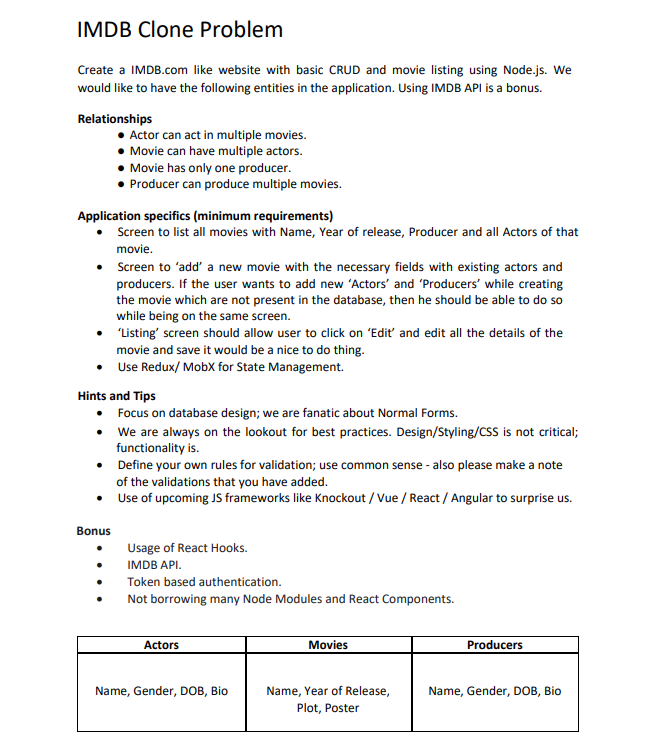

# IMDb Clone Assignment

This repository contains the backend and frontend components of the IMDb clone assignment.

## Table of Contents

1. [Project Structure](#project-structure)
2. [Getting Started](#getting-started)
3. [Backend Setup](#backend-setup)
4. [Frontend Setup](#frontend-setup)

## Project Structure

```
.
├── back-end
│   ├── src
│   ├── package.json
│   └── ...
├── front-end
│   ├── src
│   ├── public
│   ├── package.json
│   └── ...
└── README.md
```

## Getting Started

Follow the instructions below to set up the backend and frontend environments.

## Backend Setup

The backend is built using Node.js and Express.

### Prerequisites

- Node.js (14.x or higher)
- npm (6.x or higher)

### Installation

1. Navigate to the `back-end` directory:

   ```bash
   cd back-end
   ```

2. Install dependencies:
   ```bash
   yarn install
   ```

### Running the Backend

1. Start the server:
   ```bash
   yarn start
   ```
   The backend will run on `http://localhost:5000`.

## Frontend Setup

The frontend is built using React and Create React App.

### Prerequisites

- Node.js (14.x or higher)
- npm (6.x or higher)

### Installation

1. Navigate to the `front-end` directory:

   ```bash
   cd front-end
   ```

2. Install dependencies:
   ```bash
   yarn install
   ```

### Running the Frontend

1. Start the server:
   ```bash
   ysrn start
   ```
   The frontend will run on `http://localhost:3000`.

For questions, contact Souvik Maity at kingsouvik111@gmail.com.

Happy coding!

<a href="./IMDB Clone Problem (1) (1).pdf" class="image fit"></a>
